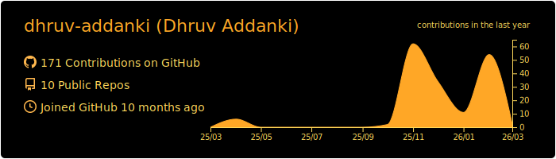

<!-- Profile README for dhruv-addanki -->

> "Brilliant thinking is rare, but courage is in even shorter supply."  
— Peter Thiel

  

<!-- 

  

 -->

## 👋 Hey — I’m Dhruv
Software Engineer (Founder/Architect/Designer/Full-Stack) building AI-powered products end-to-end.

- 🧠 Founder & Lead Engineer @ **Scanis AI** (3D body scanning + GPT evaluations + adaptive training)
- 🎓 CS @ **Virginia Tech** (Expected 2026)
- ⚙️ I love: **mobile-first UX**, applied AI, fast iteration, and building in public
  
## 🚀 What I’m building
**Scanis AI** — a digital fitness trainer powered by 3D body scans and AI.
- iOS app in Swift/SwiftUI + Firebase backend
- 3D scanning → structured body data → AI evaluation + multi-week workout plans
- Shipping + iterating with real users (TestFlight + build-in-public)
  
## 🧩 Featured projects
- **Duolingo for Learning AI** — gamified AI learning app (React Native + Expo + Supabase)
- **Nanochat LLM Inference Service** — FastAPI + streaming completions + Dockerized deployment
- **Crossword AI Engine** — constraint solving + heuristics
- **Neural Net from Scratch** — NumPy backprop / training loops
  
## 🧰 Tech stack
**Languages**
  

**Frameworks / Platforms**

**AI / ML**

## 📊 GitHub Snapshot

## 🐍 Contribution Snake

<picture>
  <source media="(prefers-color-scheme: dark)" srcset="https://raw.githubusercontent.com/dhruv-addanki/dhruv-addanki/output/github-contribution-grid-snake-dark.svg" />
  
</picture>
