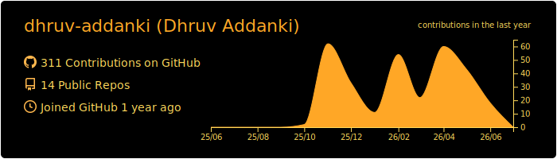

<!-- Profile README for dhruv-addanki -->

> "Brilliant thinking is rare, but courage is in even shorter supply."  
— Peter Thiel

  

## 👋 Hey — I’m Dhruv

I build AI-native products end-to-end: mobile apps, agent backends, context systems, and real-world workflows that actually ship.

- 🧠 Founder & Lead Engineer @ **Scanis** — AI fitness guidance from 3D body scans
- 🎓 CS @ **Virginia Tech** — expected 2026
- ⚙️ Focused on **mobile-first UX**, applied AI, context-aware agents, and fast product iteration

## 🚀 Current focus

**Scanis** — an AI fitness platform built around 3D body scanning, structured body data, adaptive training, and real user feedback.

- SwiftUI iOS app with Firebase-backed auth, data, and storage flows
- Scan-to-insight pipeline: body capture → structured evaluation → personalized workout plans
- Product loop across user interviews, waitlist, TestFlight-style iteration, and shipping infrastructure

**SuperAgent** — a WhatsApp-first personal AI assistant for actually getting work done.

- Connects Gmail, Google Calendar, Google Drive, and Asana behind deterministic backend tools
- Supports voice input, daily briefings, approval-gated writes, audit logs, and reply-aware task actions
- Built as a production-minded Node/TypeScript backend with Prisma, Redis, queues, and OAuth integrations

**Personal Context Graph** — an Obsidian plugin that turns ChatGPT exports into durable, human-readable memory.

- Imports conversation history into typed Markdown nodes for projects, people, preferences, decisions, and artifacts
- Uses conservative, evidence-backed merging so the graph gets more connected instead of noisier
- Generates an LLM-ready context pack while keeping the source notes readable in a normal vault

## 🧪 Selected experiments

- **CourtVision** — SwiftUI basketball session tracker with calibration, camera scaffolding, CV pipeline boundaries, and AI feedback hooks
- **AI Reflection Bracelet** — voice-first mental wellness wearable concept with FastAPI, Expo, shared types, firmware scaffolding, and mocked local analysis
- **SimuTrade** — full-stack paper trading simulator with Django REST, Celery jobs, PostgreSQL, Redis, Docker, and a Next.js dashboard
- **PM4 Food Tracker** — AI-assisted food scanning, macro logging, browser UI, API routes, and Expo mobile camera capture
- **JobSwipe AI** — SwiftUI job discovery app with swipe gestures, SwiftData persistence, profile-driven matching, and live/mock feed switching
- **nanochat / nanoGPT services** — lightweight LLM service layers, streaming APIs, and deployment-oriented model experimentation

## 🛠️ Stack I reach for

**Product surfaces:** SwiftUI, React Native, Expo, Next.js, Tailwind, Obsidian plugins, WhatsApp Cloud API

**Backends:** TypeScript, Node.js, Fastify, Python, FastAPI, Django, PostgreSQL, Prisma, Redis, Firebase, Supabase

**AI systems:** OpenAI APIs, embeddings, structured extraction, retrieval/context graphs, computer vision pipelines, PyTorch, Hugging Face

**Shipping:** Docker, Vercel, GitHub Actions, TestFlight-style mobile iteration, OAuth integrations, audit logs, and approval-gated workflows

## 📊 GitHub Snapshot

## 🐍 Contribution Snake

<picture>
  <source media="(prefers-color-scheme: dark)" srcset="https://raw.githubusercontent.com/dhruv-addanki/dhruv-addanki/output/github-contribution-grid-snake-dark.svg" />
  
</picture>
